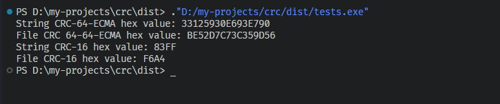

费了好大的功夫，在 WIKI 上磕磕绊绊的大概看懂了[什么是 CRC](/blog/what-is-crc)。

所以实现的步骤无非就是按字节逐个进行异或计算，例如 CRC-8 就是 CRC 位宽为 8，生成多项式编码为 9 位，就是按照 9 位逐个计算

那么如果提前提前准备一个涵盖所有编码结果的预算表，就能快速的遍历，而这个预算表的长度则为 2^10 - 1

<!-- truncate -->

## 为什么不用 js

先回顾一下 javascript 中的 Number 类型。

它是一个双精度 64 位的二进制 IEEE754 浮点数，在存储数字的大小和精度上有一定的限制，它的 64 位分别用来表示 3 个部分：

- 1 位用作符号位 sign (正负)
- 11 位用于指数位 exponent (range: -1022 to 1023)
- 52 为用于尾数位 mantissa (表示 0 和 1 之间的数值)

$$
Number=(−1)^{sign} * (1+mantissa) * 2 ^ {exponent}
$$

尾数部分在双精度浮点数中实际上是 53 位，因为还有一个隐含的 1 位，尾数部分本身其实表示的是一个介于[1, 2)之间的数。
而 11 位的指数位最大表示的是 $2^{1023}$ ，这是一个非常大的数字远超 53 位了（$10^{53} = 5^{53} * 2^{53}$），所以 Number 的精确值就由尾数部分来确定了，整数的精度范围为 $-2^{53}$ 到 $2^{53} - 1$

除了类型、精度、范围之外，还有个最大的问题就是位运算：js 中所有的位运算操作（如 AND `&`, OR `|`, NOT`~`, XOR `^`, 左移 `<<,` 右移 `>>,` 无符号右移 >>>）都基于 32 位有符号整数。

如果数据超过 32 位有符号整数的范围限制（$-2^{31}$ 到 $2^{31} - 1$），会发生溢出，只保留低 32 位的数据。

因此，在 js 中，我们无法直接使用 64 位的整数，最多只能使用 32 位的整数，这使得计算 crc 64 位的 crc 码相当麻烦。

## C++ 实现

结合上一篇的[CRC 原理](./what-is-crc)的介绍，我决定使用 C++来构建支持 64 位 crc 编码的函数，是因为 c++ 中有严格的类型限制，能让逻辑更加清晰。

计算 CRC 编码的时候需要五个关键的参数：

- `int bitWidth`： [位宽](./what-is-crc#位宽-bit-width)
- `uint64_t polynomial`：[多项式](./what-is-crc#多项式编码-polynomial-formulahex)
- `uint64_t initialValue`：[初始值](./what-is-crc#初始值-initial-value)
- `uint64_t finalXorValue`：[最终异或值](./what-is-crc#结果异或-xor-out)
- `bool refIn`：[输入反转](./what-is-crc#输入反转-reflect-in)
- `bool refOut`：[输出反转](./what-is-crc#输出反转-reflect-out)。

CRC 计算类的定义如下：

```cpp
// crc.h

class CRC {
public:
  struct CRCParams {
    int bitWidth;
    uint64_t polynomial;
    uint64_t initialValue;
    uint64_t finalXorValue;
    bool refIn;
    bool refOut;
  };

  CRC(int bitWidth, uint64_t polynomial, uint64_t initialValue,
      uint64_t finalXorValue, bool refIn, bool refOut);

  TransformOut string(const std::string &data) const;
  TransformOut file(const std::string &filePath) const;

private:
  std::vector<uint64_t> table;
  CRCParams params;
  uint64_t mask;

  uint64_t reverseBits(uint64_t value, int bitWidth) const;

  uint64_t singleCRC(uint64_t data, const uint64_t poly, const int bitWidth) const;

  std::vector<uint64_t> generateCrcTable(int bitWidth, const uint64_t polynomial);

  uint64_t calculateCRC(const std::vector<uint64_t> &table,
                        const std::vector<uint8_t> &data, const int bitWidth,
                        const bool refIn, const bool refOut,
                        const uint64_t initial, const uint64_t finalXor) const;
};
```

这里为了让输出更加直观，所以封装一个结果转化的类：

```cpp
// transform.h

class TransformOut {
public:
  TransformOut(uint64_t value, const int bitWidth = 64);
  uint64_t value() const;

  std::string bin() const;
  std::string oct() const;
  std::string dec() const;
  std::string hex() const;
private:
  const uint64_t value_;
  const int bitWidth_;
  uint64_t mask_;
};
```

这里的计划使用速查表的方式加快计算速度，因此需要使用`uint64_t singleCRC`优先计算每个字节的 CRC 编码，然后将速查表存在 `table` 中：

```cpp
// crc.cpp

uint64_t CRC::singleCRC(uint64_t data, const uint64_t poly,
                        const int bitWidth) const {
  uint64_t crc = 0;
  const uint64_t mask = 1ULL << (bitWidth - 1);
  for (int i = 0; i < bitWidth; ++i) {
    bool bit = crc & mask;
    crc <<= 1;
    if (data & mask) {
      bit = !bit;
    }
    data <<= 1;
    if (bit) {
      crc ^= poly;
    }
  }
  return crc; // 返回bitWidth位的结果
}
```

在计算字符串和文件的时候有一点不一样，字符串是将字符传换成二进制编码进行计算，而文件是获取整个文件的二进制编码再进行计算。
然后逐个字节的进行查表计算：

```cpp
// crc.cpp
TransformOut CRC::string(const std::string &data) const {
  std::vector<uint8_t> bytes(data.begin(), data.end());
  uint64_t crc =
      calculateCRC(table, bytes, params.bitWidth, params.refIn, params.refOut,
                   params.initialValue, params.finalXorValue);

  return TransformOut(crc, params.bitWidth);
}

TransformOut CRC::file(const std::string &filePath) const {
  std::ifstream file(filePath, std::ios::binary);
  if (!file.is_open()) {
    throw std::runtime_error("Failed to open file: " + filePath);
  }

  std::vector<uint8_t> bytes;
  char ch;
  while (file.get(ch)) {
    bytes.push_back(static_cast<uint8_t>(ch));
  }

  uint64_t crc =
      calculateCRC(table, bytes, params.bitWidth, params.refIn, params.refOut,
                   params.initialValue, params.finalXorValue);
  return TransformOut(crc, params.bitWidth);
}
```

查表的详细步骤有函数`calculateCRC`负责，当然也需要处理一下反转、初始值和最终异或值：

```cpp
// crc.cpp

uint64_t CRC::calculateCRC(const std::vector<uint64_t> &table,
                           const std::vector<uint8_t> &data, const int bitWidth,
                           const bool refIn, const bool refOut,
                           const uint64_t initial,
                           const uint64_t finalXor) const {
  uint64_t crc = initial;
  for (uint8_t byte : data) {
    if (refIn) {
      byte = static_cast<uint8_t>(reverseBits(byte, 8));
    }
    uint8_t index = (crc >> (bitWidth - 8)) ^ byte; // 确保索引在0-255之间
    crc = table[index] ^ (crc << 8);                // 更新CRC值
  }

  if (refOut) {
    crc = reverseBits(crc, bitWidth);
  }
  crc ^= finalXor;
  return crc & this->mask;
}

```

最后使用 cmake 进行编译构建一下就大功告成了！

## 测试

```cpp
void Tests::test_crc() {
  try {
    CRC calculatorCRC16ARC(16, 0x8005, 0x0000, 0x0000, false, false);
    std::cout << "String CRC-16 hex value: "
              << calculatorCRC16ARC.string(data).hex() << "\n"
              << "File CRC-16 hex value: "
              << calculatorCRC16ARC
                     .file("D:\\my-projects\\crc\\src\\transform.cpp")
                     .hex()
              << std::endl;
  } catch (const std::exception &e) {
    std::cerr << "Error: " << e.what() << std::endl;
  }
}
```

运行如下：


## 源码

[crc](https://github.com/JF-Just-Fun/crc)
