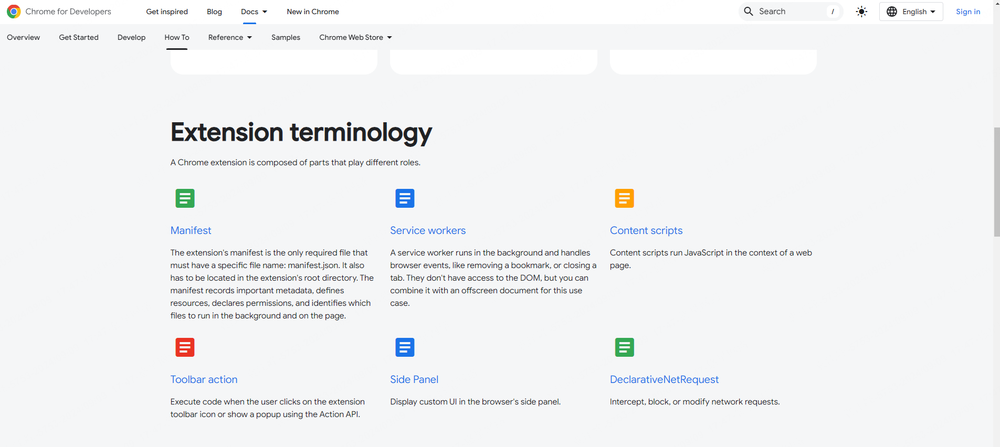
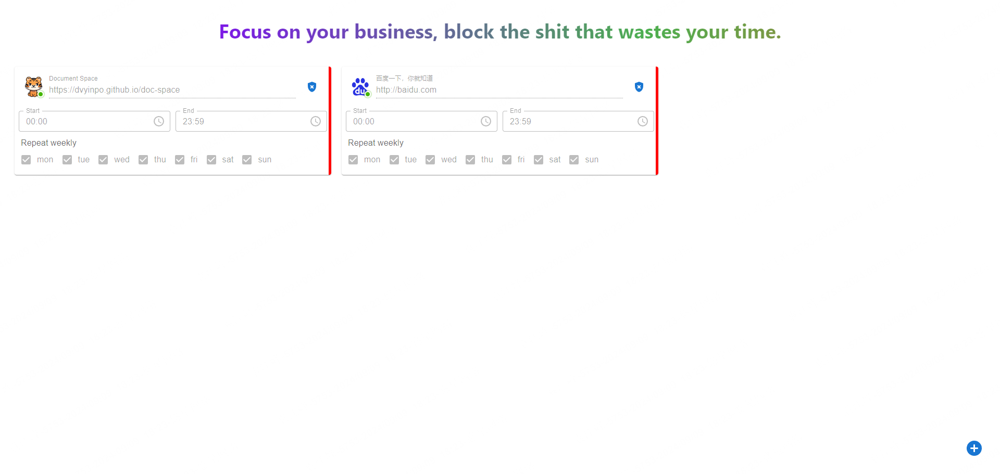
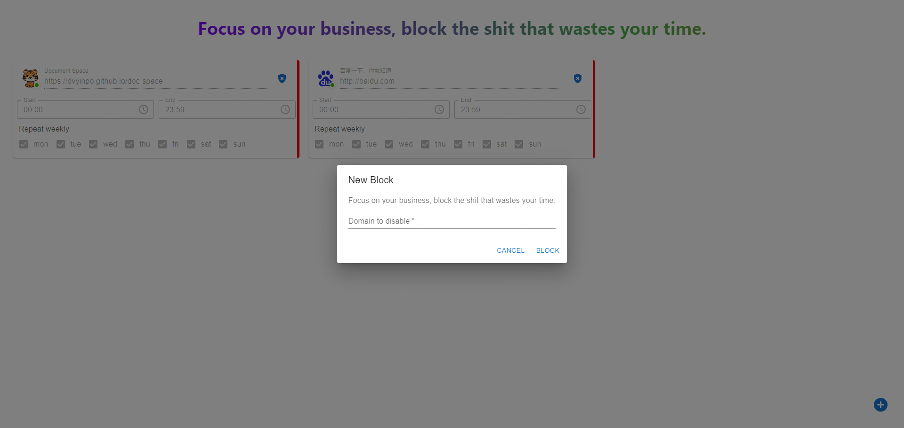
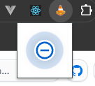
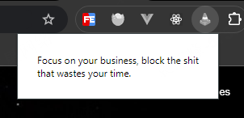
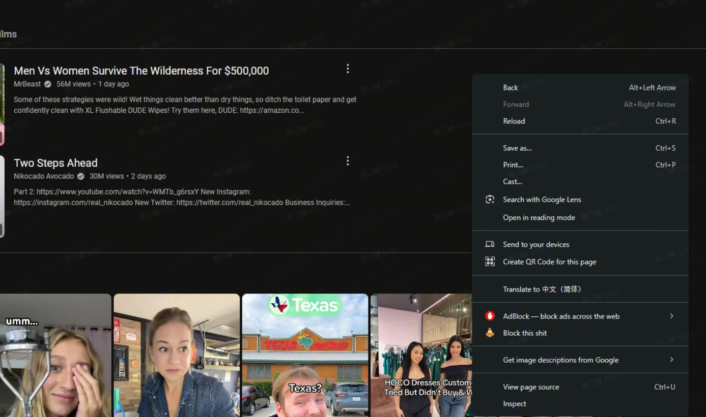
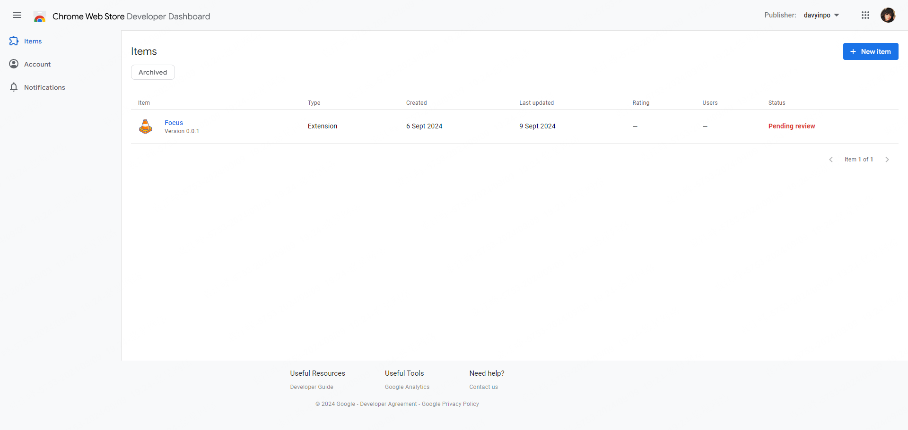
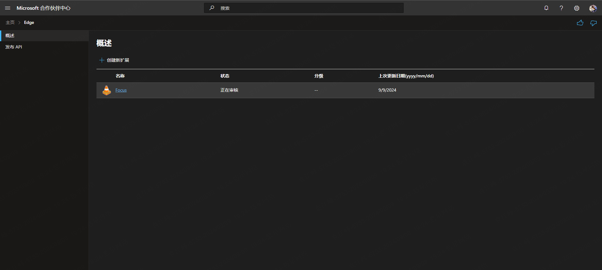

# Chrome Extension Focus

摸鱼的时候，无意间的看到了 chrome developer 的[文档](https://developer.chrome.com/docs/extensions/get-started)，其中有一个东西特别吸引我:

> _DeclarativeNetRequest_:Intercept, block, or modify network requests.



因为最近下班之后，有件事总是困扰我。下班我会在地铁上安排好今晚任务，例如争取通关《王国之泪》，但现实往往是被 B 站吸引一直在刷 lol、cod 的视频,直到夜深，一天的大好时光就结束了，switch 充满电又蒙上灰。

所以我想要是能给它屏蔽就好了，这样能提醒我去做自己该做的事，不被多巴胺牵着鼻子。

直到看到了这个 api，我觉得这是一个尝试的契机。

<!-- truncate -->

## 框架

摸鱼时间有限，也为了节约时间，最好的办法当然是找一个框架来快速开发。最好是成熟一点、高 star 的，经过搜索发现[plasmo](https://github.com/PlasmoHQ/plasmo)挺符合要求的。

按照惯例，找到文档的 get start 就算是入门了。意外发现文档齐全，步骤清晰，说明这事成的概率很大。

按照文档搭建了项目之后，需要快速的预览一遍文档内容，熟悉一下框架。

根据文档，总结框架使用如下：

1. 不需要配置 manifest.json，plasmo 会自动生成，除了权限需要再 package.json 中指定之外。
2. 插件关键组件基本上就是一个文件夹的事，例如`background`, `content`, `popup`, `options等`
3. 可以使用 `react` 或者 `vue`，以及对应的生态。

到这里就够了，能用 `react`和`vue`解决，就已经排除了 90%的问题。

除了 plasmo 框架之外，还需要简单的了解一下 chrome extension 的 api。
主要的就是两点：

1. 如何屏蔽网站？
2. 如何传递消息？

因为插件的固定组件分为一下几个：

1. background script: 插件的主要进程。是 chrome extension 特定的 api 执行环境。
2. content script: 插入到各个网页内容中执行的，可以独立环境，也可以使用相同的 window。
3. popup page: 游览器上点击插件 icon 的时候出现的界面。
4. options page: 一个配置界面。

所以一个插件的基本执行逻辑就是，各个组件向 background 发送消息，background 进行处理，从而实现对网页进行屏蔽或者修改。

## 插件页面

首先需要一个配置界面，起码得知道哪个网页被屏蔽了吧。
因为框架能将 react 组件直接打包成一个页面，所以构建一个 options page 相对简单。

> 为了缩减篇幅方便理解，下面的所有代码均为伪代码

```ts
// options/index.tsx

const styleElement = document.createElement("style");
window.document.body.appendChild(styleElement);

const styleCache = createCache({
  key: "plasmo-mui-cache",
  prepend: true,
  container: styleElement,
});

export default function OptionsIndex() {
  const [rules, setRules] = useState<TStorage[StorageKeys.RULES]>([]);

  return (
    <CacheProvider value={styleCache}>
      <AddDialog addRule={handleAddRule} />
      <StyleOptionsHeader>{description}</StyleOptionsHeader>
      {rules.map((item) => (
        <RuleItem key={item.id} {...item} onChange={handleSetRule} onDelete={handleDeleteRule} />
      ))}
    </CacheProvider>
  );
}
```

这里使用了 mui 的组件，可能是因为 dom 环境的区别，需要创建 styleCache 才能正确显示样式。最终效果如下：




然后就是 popup 组件了，这个更加的简单，设计不出来什么好看的样式了，直接放一个按钮得了：

```ts
// popup.tsx
function IndexPopup() {
  return (
    <RippleStep onClick={handleBlockAction}>
      <RemoveCircleOutlineIcon />
    </RippleStep>
  );
}
```

效果如下：


看着 vue 的插件 icon 我陷入了沉思，我觉得有必要也加一个变灰的功能，这样能够提示用户当前 tab 之下插件无法使用。

请教 chatGPT 之后，原来只需要监听 tab 的状态就行了，通过判断是否是正常的 http 或 https 协议来更新 icon 。

```ts
// popup and icon
function updateAction(tab) {
  if (/* tab is http */) {
    chrome.action.setPopup(/* active */);
    chrome.action.setIcon(/* active */);
  } else {
    chrome.action.setPopup(/* inactive */);
    chrome.action.setIcon(/* inactive */);
  }
}
chrome.tabs.onUpdated.addListener(updateAction);
chrome.tabs.onActivated.addListener(function (activeInfo) {
  chrome.tabs.get(activeInfo.tabId, function (tab) {
    updateAction(tab);
  });
});
```

效果如下，在非 http 页面，插件会变灰，并且页面内容会变：


## Background Service Worker

插件的逻辑主要在 background service worker 中实现，background service worker 是一个单独的进程，与插件的其它组件不在同一个进程，所以需要通过消息传递来完成。

### Storage API

使用 plasmo 的 storage api 来实现数据存储，使用起来非常简单，并且不需要区分不同的存储区域（sync 和 local）的差异。
也主要是因为懒得看具体有什么差异了,能够梭哈那就直接梭哈算球了。

这里对 storage 的使用也比较简单，主要是存储一下 rule 的信息，例如，网站的 url，favicon，title 和定时范围。

```ts
const storage = new Storage();

export function getRule(id: number): Promise<IRule | undefined>;
export function getRule(): Promise<TStorage[StorageKeys.RULES]>;
export async function getRule(id?: number) {
  /* your code */
}

export const setRule = async (data: Partial<IRule>) => {
  /* your code */
};

export const removeRule = async (id: number) => {
  /* your code */
};
```

### Messaging

这里遇见了一点小坑，因为是先看到的 chrome developer document，所以直接使用的 chrome.runtime.sendMessage 的 API 来实现的消息传递。

dev 的时候没有任何问题，最后打包之后发现运行一直在报错:

- `Unchecked runtime.lastError: The message port closed before a response was received.`
- `Unchecked runtime.lastError: The page keeping the extension port is moved into back/forward cache, so the message channel is closed.`

不知道什么原因，后来在 plasmo 的文档上看到了 message 的 api，切换过来之后就能正常运行了，我怀疑是 plasmo 做了什么处理导致的。
最终 message 的结构如下：

```text
|- background
  |- messages
    |- block-this-tab.ts // 屏蔽当前tab的网页
    |- storage-check-rule-exist.ts // 检查是否已经存在某条规则
    |- storage-remove-rules.ts // 删除某条规则
    |- storage-rules.ts // 获取某条规则
    |- storage-set-rules.ts // 设置某条规则
    |- url-in-effect.ts // 判断指定的url是否处于屏蔽状态
```

这里的每个 ts 文件对应了一个消息类型，每个消息类型对应了具体的处理函数。

在插件的 options page 中就能通过 message 让浏览器屏蔽对应的网站了。

```ts
import { sendToBackground } from "@plasmohq/messaging";

const getRules = async () => {
  const res = await sendToBackground({
    name: "storage-rules",
    extensionId: chrome.runtime.id,
  });
  if (res.Ok && res.data?.storageRules) {
    setRules(res.data?.storageRules);
  }
};

const handleDeleteRule = async (id: number) => {
  const res = await sendToBackground({
    name: "storage-remove-rules",
    body: {
      id,
    },
    extensionId: chrome.runtime.id,
  });

  if (res.Ok) {
    setRules(res.data.rules);
  }
};

const handleSetRule = async (data: Partial<IRule>) => {
  const res = await sendToBackground({
    name: "storage-set-rules",
    body: {
      rule: data,
    },
    extensionId: chrome.runtime.id,
  });

  if (res.Ok) {
    getRules();
  }
};
```

## Menu Item

最后加一个鼠标右键的 Menu Item 就算是完工了

```ts
chrome.runtime.onInstalled.addListener(async () => {
  chrome.contextMenus.create({
    id: MENU_ID,
    title: "Block this shit",
    contexts: ["page"],
    documentUrlPatterns: ["http://*/*", "https://*/*"],
  });
});

// 监听右键菜单点击事件
chrome.contextMenus.onClicked.addListener((info, tab) => {
  if (info.menuItemId === "focus-menu:block-this-domain") blockThisTab(tab);
});
```

最终效果如下：


## Publish

### Chrome Web Store



### Edge Add-ons


