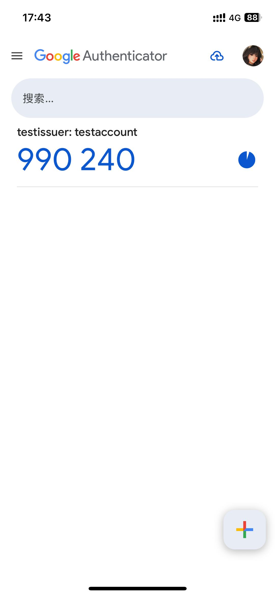

# TOTP

全称 Time-Based One-Time Password 即基于时间的一次性密码，TOTP 属于 OTP 的一种实现方式，基于当前时间与密钥计算的动态密码，通常每 30s 刷新一次。

生成 TOTP 无需网络，前提是当前时间是准确的。服务方与本地生成的 TOTP 相同，则说明校验通过。

<!-- truncate -->

## Introduce

### 2FA

全称 Two-Factor Authentication 即双重因素认证。这是一个抽象的概念而不是特定的算法。

要求用户提供两种不同类型的凭证：

1. 第一因素，常见的密码、PIN 码等
2. 第二因素，如硬件令牌、指纹或者面部识别等其他固有或拥有的认证方式

其中 OTP 就可以作为 2FA 的第二个因素。当然还有很多其他的验证方式也都能作为第二因素作为校验方式。

### OTP

全称 One-Time Password 即一次性密码，仅在一次登录会话或者交易中有效，使用后立即失效。

### HOTP

全称 HMAC-Based One-Time Password 即基于计数器的一次性密码算法。

核心原理：

1. 共享密钥(Secret Key): 用户和服务端预先共享的一个密钥
2. 计数器(Counter): 一个不断递增的数字(每次验证后+1)

公式如下：

```
HMAC-SHA1(SecretKey, Counter) → 截取6-8位数字
```

HOTP 的关键在于 Counter 的同步。当出现 Counter 不同步情况的时候，需要额外的手段确保 Counter 同步：

1. 服务端窗口，例如服务端允许验证一定范围内的密码[Counter, Counter + N], 然后更新到客户端的 Counter + 1
2. 手动同步，如果差距过大，可能需要连续输入两个有效的密码，服务端根据两次密码计算正确的 Counter。

与 TOTP 相比：

| 特性     | HOTP                             | TOTP                               |
| -------- | -------------------------------- | ---------------------------------- |
| 基础机制 | 基于计数器（Counter）            | 基于时间（Time）                   |
| 密码更新 | 每次使用后计数器+1               | 每 30 秒自动更新（基于时间戳）     |
| 同步要求 | 单向同步 Counter，客户端无需网络 | 需时间同步（允许 ±1 个时间窗口）   |
| 典型应用 | 硬件令牌（如 YubiKey）、离线验证 | 软件认证器（Google Authenticator） |
| 安全性   | 较高，但可能因计数器不同步失效   | 较高，依赖时间同步                 |
| 触发时机 | 手动触发，更新 Counter           | 基于时间自动生成                   |

根据 HTOP 的特性可以了解到，服务端需要不断的同步用户本地客户端的 Counter

在实际应用场景中大部分都是使用 TOPT：

1. TOTP 安全性更高
   TOTP 只在当前时间窗口内生效，过期会自动失效。而 HOTP 在生成密码之后，在计数器递增钱一直有效。
2. TOTP 更加方便
   HOTP 通常需要物理设备，如 U 盾、令牌等。并且每次生成密码都需要手动的触发。
   TOTP 软件即可实现，且密码基于时间自动刷新。

## 标准 TOTP URL 格式

otpauth:// URL 格式并非 [RFC 6238](https://www.rfc-editor.org/rfc/rfc6238) 中定义的，而是 Google Authenticator 后来引入的扩展

```
otpauth://totp/{issuer}:{account}?secret={BASE32_SECRET}&issuer={issuer}&algorithm={ALGORITHM}&digits={DIGITS}&period={PERIOD}
```

| 参数                     | 必填 | 说明                                                        |
| ------------------------ | ---- | ----------------------------------------------------------- |
| `otpauth://totp/`        | ✅   | 固定前缀，表示 TOTP 协议。还支持 HOTP。                     |
| `{issuer}:{account}`     | ✅   | 发行方（服务名称）和用户标识（如邮箱/用户名），用冒号分隔。 |
| `secret={BASE32_SECRET}` | ✅   | Base32 编码的密钥（用于生成 OTP 的核心参数）。              |
| `issuer={issuer}`        | ❌   | 再次明确发行方（某些应用要求必须填写）。                    |
| `algorithm={ALGORITHM}`  | ❌   | 哈希算法（默认 SHA1，可选 SHA256/SHA512）。                 |
| `digits={DIGITS}`        | ❌   | OTP 位数（默认 6，可选 8）。                                |
| `period={PERIOD}`        | ❌   | 时间步长（秒，默认 30，可选 15/60 等）。                    |

### 参数 `issuer:account`

按照标准来说，该参数为必填，即使 issuer 和 account 为空，依然要求填写冒号`:`来做分割。
但是实际应用时，可以相对宽松一点，可以有不同的策略，例如：

1. 非必填，为了增加容错可以允许不填，然后默认成`未知/unknown`。
2. 没有冒号分隔，那就识别成为 account，issuer 使用 url 中单独的参数获取。

### 参数 `algorithm`

在 TOTP 与 HOTP 的实现中，仅支持 `SHA1`、`SHA256` 和 `SHA512`，而没有支持其他的 SHA 家族算法。

因为 TOTP/HOTP 使用 HMAC (Hash-based Message Authentication Code)，而 HMAC 的数日密钥长度需要与
哈希算法的块大小匹配：

1. SHA1：64 字节块大小 ，兼容 20 字节密钥
2. SHA256：64 字节块大小，兼容 32 字节密钥
3. SHA512：128 字节块大小，兼容 64 字节密钥

对于其他的 SHA 变种(SHA224、SHA384)的块大小与 SHA256/SHA512 相同，但是输出长度不同，可能导致：

1. 额外的填充或者阶段逻辑
2. 没有实际性能或安全优势

未来可能会逐步淘汰 SHA1，并且增加 SHA-3 的支持。

### 参数 `secret`

secret 参数必须是 Base32 编码的（仅包含字母 A-Z 和数字 2-7， 不区分大小写），主要是因为 Base32 大小写不敏感且易于人工输入。
Base32 的计算原理是：

1. 分组：将二进制数据按 5 位一组进行分割（因为 2^5 = 32）,最后一组不足五位时用`0`填充
2. 映射：每组 5 位值(0 -> 31)对应一个 Base32 字符（从 A -> Z -> 2 -> 7 的顺序）
3. 补等于号=：最终输出需要以 8 字符位一组，如果少于 8 位则需要使用等于号=补齐

例如： `hello` 二进制编码为 `01101000 01100101 01101100 01101100 01101111`

1. 分组：01101 00001 10010 10110 11000 11011 00011 01111
2. 映射：N B S W Y 3 D P

所以最终的结果为: `hello` => `NBSWY3DP`

这里看下另一种情况：`你好` 二进制编码为 `11100100 10111101 10100000 11100101 10100101 10111101`

1. 分组：11100 10010 11110 11010 00001 11001 01101 00101 10111 10100
2. 映射：4 S 6 2 B Z N F X U
3. 补=：最终只有 10 位，需要补齐到 16 位，则输出应为 4S62BZNF XU======

## TOPT 计算逻辑

1. 时间步 T (十六进制字符串)

获取当前时间戳(秒级)，除以时间步长(参数 period， 默认是 30s)，得到的整数部即为所需的时间 t

> 因为 TOTP 是 HOTP 的扩展，而在 HOTP 的 RFC 文档中明确要求了 Counter 必须为*8 字节的大端序整数*。
> 所以在 TOTP 中也延用了这一规范，能够很好的兼容，另外也为未来时间戳做足了预留。

然后将 t 转化为 大端字节序的 8 字节二进制即 64 位长整数（少则前补零）获取时间步编码 T

2. HMAC-SHA 计算

使用 Base32 解码后的共享密钥作为 HMAC 密钥，时间步 T 作为消息，计算 HMAC-SHA 哈希

3. 动态截断(DT)

取哈希最后 4 位为偏移量`offset`，例如哈希结果是 16 进制的，则是最后一个字符作为偏移量

从偏移位置开始截取 4 字节，忽略最高位避免符号问题，共 31 位。

```
int binary = ((hash[offset] & 0x7f) << 24) |
             ((hash[offset + 1] & 0xff) << 16) |
             ((hash[offset + 2] & 0xff) << 8) |
             (hash[offset + 3] & 0xff);
```

4. 生成 TOTP

将截取的 31 位转为十进制，模以 10^digits，如 digits = 6，则模 1000000

```
TOTP = 截断值 mod 10^digits
```

最后如果编码少于 digits，则在首位补零，将结果补零到固定长度

## 举例

对于 TOTP URL 为 `otpauth://totp/testaccount?secret=NBSWY3DP&issuer=testissuer&digits=6&period=20&algorithm=SHA256` 的服务进行计算

在北京时间 2025-07-30 17:43:10 下截图 Google Authenticator 的密码如下：


即时间戳为 `1753868590` 则 TOTP 结果为 `990240`

1. 获取时间步
   因为 period=20，故 t = 1753868590 / 20 = 87693429

   转化为十六进制,并补零为 64 位，故 T = 00000000053A1875

2. 计算 HMCA-SHA
   将 T = 00000000053A1875 作为内容，secret = NBSWY3DP 作为密钥，使用 SHA256 算法计算，得到结果：

   `2373861434FCEA20A86FFA9B595CD87987BF51ECF67737EBEF8F1AF2C000EF44`

3. 截断
   取 hash 最后 4 位，即十六进制字符`4`作为偏移量，得到偏移量 offset = 4

   hash[offset] -> hash[offset + 4]

   截取 4 位字节，即十六进制中的 8 个字符，故截取 hash 中的 `34FCEA20`

4. 生成
   将`34FCEA20`转化位 64 位的二进制数据：`00110100111111001110101000100000`

   忽略首位即 `0110100111111001110101000100000`

   其十进制结果为 `888990240`

   最后根据 digits=6 取模：
   888990240 mod 10^6 = 990240
